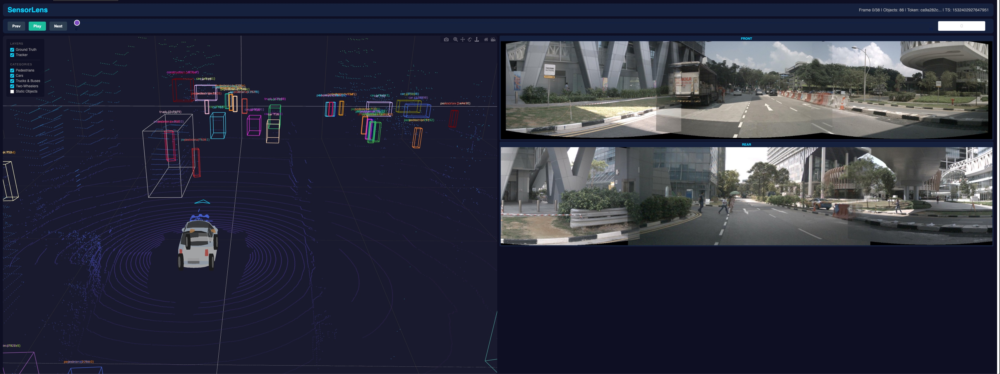

# SensorLens

Interactive 3D visualization tool for multi-object tracking on nuScenes data. Built for visual debugging and comparison of tracker output against ground-truth annotations.



## Features

### 3D Scene View
- **LiDAR point cloud** rendered with height-based Turbo colormap (WebGL-accelerated via Plotly)
- **3D wireframe bounding boxes** for ground-truth detections and/or tracker output, displayed simultaneously with distinct identity-consistent coloring
- **3D ego vehicle model** loaded from OBJ/MTL with per-face material colors and a forward-direction indicator
- **Category filtering** — toggle visibility of pedestrians, cars, trucks/buses, two-wheelers, and static objects independently
- **Layer toggles** — show/hide GT and tracker overlays independently or together

### Camera Panoramas
- **Stitched front panorama** from CAM_FRONT_LEFT, CAM_FRONT, and CAM_FRONT_RIGHT (~180° FOV)
- **Stitched rear panorama** from CAM_BACK_LEFT, CAM_BACK, and CAM_BACK_RIGHT (~180° FOV)
- Cylindrical projection with precomputed remap tables using camera intrinsics and extrinsics from nuScenes calibration data
- Weighted blending in overlap regions for seamless transitions

### Playback
- **Prev / Next** buttons for frame-by-frame stepping
- **Play / Pause** auto-advance at ~2 FPS (nuScenes keyframe rate)
- **Frame slider** to jump to any frame
- **Frame info bar** showing frame index, object count, sample token, and timestamp

## Installation

```bash
cd Project_SensorLens
pip install -r requirements.txt
```

Requires the nuScenes dataset (mini or full) at the path specified by `--dataroot`.

### Dependencies

- `dash` / `plotly` — web UI and 3D rendering
- `numpy` — point cloud and geometry operations
- `opencv-python` — panorama stitching (cv2.remap)
- `nuscenes-devkit` — dataset access (samples, calibration, ego poses)
- `pyquaternion` — rotation handling

## Usage

```bash
python3 run.py \
  --gt ../Project_MOT/results/gt/scene_0000.json \
  --tracker ../Project_MOT/results/tracking/results_20260511_233838.json
```

Then open http://localhost:8050 in your browser.

Either or both of `--gt` / `--tracker` can be provided. At least one is required.

### CLI Arguments

| Argument     | Default                      | Description                     |
|-------------|------------------------------|---------------------------------|
| `--dataroot`| `/workspace/data/nuscenes`   | Path to nuScenes dataset        |
| `--version` | `v1.0-mini`                  | nuScenes version string         |
| `--gt`      | —                            | Path to GT detections JSON      |
| `--tracker` | —                            | Path to tracker results JSON    |
| `--port`    | `8050`                       | Server port                     |
| `--host`    | `0.0.0.0`                    | Host to bind to                 |

## Controls

| Action | Input |
|--------|-------|
| Orbit 3D view | Left-click drag |
| Zoom | Scroll wheel |
| Pan | Right-click drag |
| Step frame | Prev / Next buttons |
| Auto-play | Play / Pause button |
| Jump to frame | Drag the frame slider |
| Toggle GT / Tracker | Layer checkboxes (top-left overlay) |
| Filter categories | Category checkboxes (top-left overlay) |

## Data Formats

### GT Detections JSON

Array of frames, each containing detections in global coordinates:

```json
[
  {
    "sample_token": "ca9a282c9e77460f...",
    "timestamp": 1532402927647951,
    "detections": [
      {
        "instance_token": "6dd2cbf4c24b4cae...",
        "category_name": "vehicle.car",
        "translation": [353.794, 1132.355, 0.602],
        "size": [2.011, 4.633, 1.573],
        "yaw": -0.4034
      }
    ]
  }
]
```

- `translation`: [x, y, z] in global frame (meters)
- `size`: [width, length, height] in meters
- `yaw`: rotation about z-axis (radians)
- `instance_token`: unique object identity across frames (drives consistent coloring)
- `category_name`: nuScenes category (e.g. `vehicle.car`, `human.pedestrian.adult`)

### Tracker Output JSON

```json
[
  {
    "frame_id": 0,
    "timestamp": 1532402927647951.0,
    "tracks": [
      {
        "id": 0,
        "category_name": "vehicle.car",
        "translation": [353.8, 1132.4, 0.6],
        "size": [2.011, 4.633, 1.573],
        "yaw": -0.4034
      }
    ]
  }
]
```

- `id`: integer track ID (drives consistent coloring across frames)

## Architecture

```
sensorlens/
  app.py             — Dash application layout and callbacks
  data_loader.py     — nuScenes data access, coordinate transforms, category mapping
  scene_builder.py   — 3D figure construction (point cloud, boxes, ego car model)
  image_stitcher.py  — Cylindrical panorama stitching with precomputed remap tables
  assets/
    style.css        — Checkbox/UI styling
    NormalCar2.obj   — 3D ego vehicle model (Blender export)
    NormalCar2.mtl   — Material definitions (7 materials)
run.py               — CLI entry point
```
